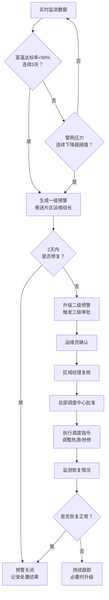
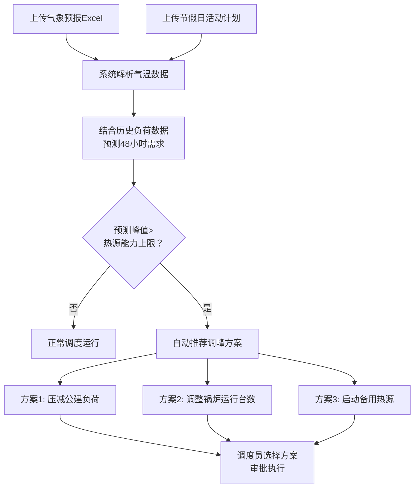

## 1. 产品概述

全国性智慧供热管网运营监测与智能调度分析平台，面向供热集团总部、区域运营中心及换热站运维人员，实现百万级传感器数据实时接入、热负荷智能计算、多级预警联动、负荷预测调峰及运营诊断全闭环管理，助力供热企业降本增效、保障民生供暖质量。

## 2. 核心功能

### 2.1 用户角色

| 角色 | 注册方式 | 核心权限 |
|------|----------|----------|
| 总部调度管理员 | 管理员分配 | 查看全国所有供热数据、审批二级预警、生成全国运营报告、管理所有用户 |
| 区域经理 | 管理员分配 | 查看所辖区域供热数据、复核二级预警、查看区域运营报告 |
| 片区运维组长 | 管理员分配 | 接收一级预警推送、确认二级预警、查看片区换热站数据 |
| 换热站运维员 | 管理员分配 | 查看本站供热明细、执行抢修任务、上报运维状态 |

### 2.2 功能模块

1. **全国总览看板**：全国供热质量热力图、核心KPI指标卡、投诉率排名、城市下钻入口
2. **区域详情看板**：换热站列表与状态、7天供水温度趋势曲线、用户室温分布箱线图、片区KPI对比
3. **预警管理中心**：预警列表与筛选、预警升级流程、三级审批工作流、预警处置记录
4. **负荷预测与调度**：气象预报上传、48小时负荷预测曲线、调峰方案推荐、锅炉运行调度
5. **运营诊断报告**：周报自动生成、室温达标率同比环比、热损耗原因分布、能耗成本分析、优化建议

### 2.3 页面详情

| 页面名称 | 模块名称 | 功能描述 |
|----------|----------|----------|
| 全国总览看板 | KPI指标区 | 实时展示全国热负荷总量、平均供热效率、热损耗率、室温达标率四大核心指标 |
| 全国总览看板 | 全国热力图 | 按城市着色展示供热质量等级（优/良/中/差），支持城市点击下钻 |
| 全国总览看板 | 投诉率排名 | 展示Top10城市投诉率排行，含投诉量、投诉率、环比变化 |
| 全国总览看板 | 预警概览 | 展示当前一级/二级/三级预警数量及最新预警动态 |
| 区域详情看板 | 换热站列表 | 按片区/状态筛选换热站，展示站名、供水温度、回水温度、压力、达标率 |
| 区域详情看板 | 温度趋势曲线 | 选中换热站近7天供水温度时序折线图，支持多站对比 |
| 区域详情看板 | 室温分布箱线图 | 选中片区用户室温分布箱线图，显示中位数、四分位、异常值 |
| 区域详情看板 | 片区KPI对比 | 各片区供热效率、达标率、热损耗率柱状对比图 |
| 预警管理中心 | 预警列表 | 按级别/状态/时间筛选预警，展示预警详情及处置进度 |
| 预警管理中心 | 预警升级流程 | 展示一级→二级→三级预警自动升级逻辑及时间线 |
| 预警管理中心 | 三级审批工作流 | 运维员确认→区域经理复核→总部调度批准的审批流程界面 |
| 预警管理中心 | 处置记录 | 预警处置历史、操作人、处置措施、恢复时间 |
| 负荷预测与调度 | 气象数据上传 | 支持上传气象预报Excel，自动解析气温骤降预警 |
| 负荷预测与调度 | 负荷预测曲线 | 48小时供热需求预测折线图，叠加热源能力上限线 |
| 负荷预测与调度 | 调峰方案推荐 | 当预测超能力时推荐最优方案（压减公建负荷、调整锅炉台数等） |
| 负荷预测与调度 | 节假日计划 | 上传节假日活动计划，关联负荷预测调整 |
| 运营诊断报告 | 周报概览 | 自动生成周度运营诊断报告，含达标率、损耗、能耗摘要 |
| 运营诊断报告 | 达标率分析 | 室温达标率同比环比趋势、各区域达标率排名 |
| 运营诊断报告 | 热损耗分析 | 热损耗原因分布饼图、管段损耗排名 |
| 运营诊断报告 | 能耗成本分析 | 能耗成本柱状图、单位面积能耗对比、成本趋势 |
| 运营诊断报告 | 优化建议 | 基于数据趋势推荐管网水力平衡和入户调节策略 |

## 3. 核心流程

### 3.1 预警触发与升级流程

系统持续监测室温达标率和管网压力数据。当某区域连续3天室温达标率低于90%时，自动生成一级预警推送至片区运维组长；若2天内未修复，系统自动升级为二级预警并触发三级审批流程（运维员确认→区域经理复核→总部调度中心批准），审批通过后调整热源出力或启动应急抢修。

### 3.2 负荷预测与调峰流程

## 4. 用户界面设计

### 4.1 设计风格

- **主色调**：深蓝色(#0F172A)为背景底色，搭配暖橙色(#F97316)作为供热主题强调色，科技蓝(#3B82F6)作为数据辅助色
- **辅助色**：预警红(#EF4444)、预警黄(#F59E0B)、达标绿(#22C55E)、中性灰(#64748B)
- **按钮风格**：圆角8px，hover态微浮起+阴影，主操作按钮使用暖橙色填充
- **字体**：数字/数据使用DIN Alternate或JetBrains Mono，正文使用思源黑体/Noto Sans SC
- **布局风格**：左侧深色导航栏+顶部面包屑+主内容区卡片式布局
- **图标风格**：线性图标，统一2px描边，使用Lucide图标库
- **动效**：数据卡入场渐显、热力图区域hover放大、预警条目滑入、图表数据更新过渡动画

### 4.2 页面设计概览

| 页面名称 | 模块名称 | UI元素 |
|----------|----------|--------|
| 全国总览看板 | KPI指标区 | 4个数据卡片横排，数字大号字体，环比箭头指示，渐变背景 |
| 全国总览看板 | 全国热力图 | SVG中国地图，四色渐变着色，hover弹出城市摘要tooltip，点击下钻 |
| 全国总览看板 | 投诉率排名 | 横向条形图，渐变色条，排名数字高亮 |
| 全国总览看板 | 预警概览 | 3个圆形计数徽章（红/黄/蓝），下方最新预警滚动列表 |
| 区域详情看板 | 换热站列表 | 表格+状态标签，支持搜索和筛选，行点击展开详情 |
| 区域详情看板 | 温度趋势曲线 | ECharts折线图，多系列叠加，tooltip显示精确值 |
| 区域详情看板 | 室温分布箱线图 | ECharts箱线图，标注中位数和异常点，颜色区分片区 |
| 区域详情看板 | 片区KPI对比 | 分组柱状图，hover显示详细数值 |
| 预警管理中心 | 预警列表 | 卡片列表，左侧色条标识级别，状态标签，时间线 |
| 预警管理中心 | 三级审批 | 步骤条组件，3步骤+当前状态，操作按钮 |
| 负荷预测与调度 | 负荷预测曲线 | ECharts双Y轴图（气温+负荷），预测区域虚线+阴影带 |
| 负荷预测与调度 | 调峰方案 | 方案卡片，含方案名、预期效果、影响范围，选择按钮 |
| 运营诊断报告 | 周报概览 | A4纸样报告预览，目录导航，章节分页 |
| 运营诊断报告 | 图表分析 | 嵌入式ECharts图表（同比环比折线、饼图、柱状图） |

### 4.3 响应式设计

- 桌面优先设计，最小支持1280px宽度
- 1920px及以上完整展示所有模块
- 1280-1920px区间自适应缩放图表和卡片
- 数据表格支持横向滚动
- 移动端暂不做适配（运营平台以PC为主）

## 4.4 数据规模说明

- 热源厂数据点：全国约500个热源厂
- 一次网传感器：约10万个压力/流量采集点
- 换热站：约5万个站点，出水温度实时采集
- 用户室温采集器：约100万个数据点
- 数据刷新频率：传感器5秒/次，KPI指标1分钟聚合
