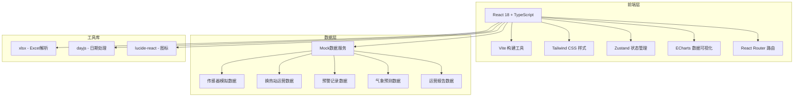
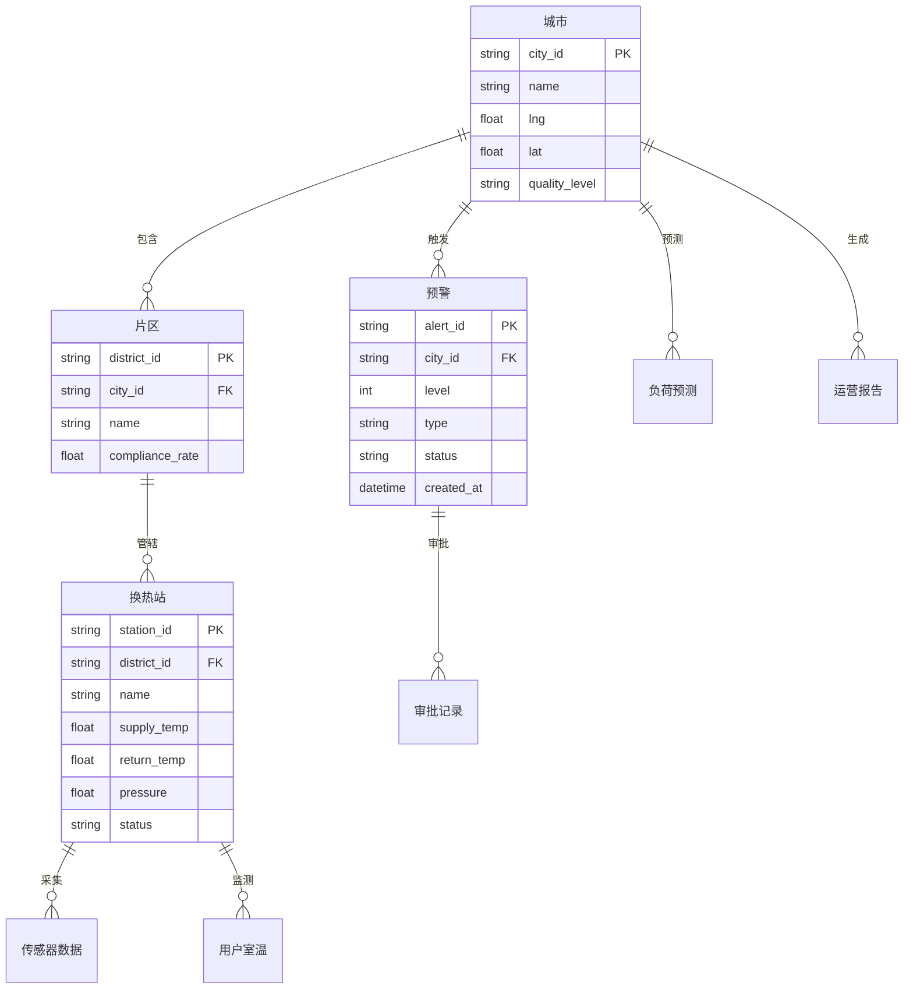

## 1. 架构设计



## 2. 技术说明

- **前端框架**：React 18 + TypeScript
- **构建工具**：Vite
- **样式方案**：Tailwind CSS 3
- **状态管理**：Zustand
- **路由方案**：React Router DOM v6
- **图表库**：ECharts（通过echarts-for-react封装）
- **Excel解析**：xlsx（SheetJS）
- **日期处理**：dayjs
- **图标库**：lucide-react
- **后端服务**：无后端，使用Mock数据模拟百万级数据点聚合结果
- **数据库**：无数据库，前端本地模拟数据

## 3. 路由定义

| 路由 | 用途 | 权限 |
|------|------|------|
| `/` | 重定向至总览看板 | 所有角色 |
| `/dashboard` | 全国总览看板 | 所有角色（数据范围按权限过滤） |
| `/dashboard/:cityId` | 区域详情看板（按城市下钻） | 区域及以上角色 |
| `/alerts` | 预警管理中心 | 所有角色 |
| `/forecast` | 负荷预测与调度 | 区域及以上角色 |
| `/reports` | 运营诊断报告 | 所有角色 |
| `/login` | 登录页 | 未登录用户 |

## 4. API定义（Mock数据接口）

### 4.1 数据类型定义

```typescript
interface KPIData {
  totalHeatLoad: number;
  avgHeatingEfficiency: number;
  heatLossRate: number;
  roomTempComplianceRate: number;
  timestamp: string;
}

interface CityHeatData {
  cityId: string;
  cityName: string;
  qualityLevel: 'excellent' | 'good' | 'medium' | 'poor';
  complianceRate: number;
  complaintRate: number;
  heatLoad: number;
  lng: number;
  lat: number;
}

interface HeatStation {
  stationId: string;
  stationName: string;
  district: string;
  supplyTemp: number;
  returnTemp: number;
  pressure: number;
  complianceRate: number;
  status: 'normal' | 'warning' | 'error';
  tempHistory: { time: string; supplyTemp: number; returnTemp: number }[];
}

interface Alert {
  alertId: string;
  level: 1 | 2 | 3;
  type: 'temperature' | 'pressure';
  region: string;
  stationName: string;
  description: string;
  status: 'pending' | 'confirmed' | 'reviewed' | 'approved' | 'resolved';
  createdAt: string;
  updatedAt: string;
  assignedTo: string;
  approvalChain: ApprovalStep[];
}

interface ApprovalStep {
  step: number;
  role: string;
  assignee: string;
  status: 'pending' | 'approved' | 'rejected';
  comment: string;
  timestamp: string;
}

interface ForecastData {
  timestamp: string;
  predictedLoad: number;
  capacity: number;
  temperature: number;
}

interface PeakShavingPlan {
  planId: string;
  name: string;
  description: string;
  expectedEffect: string;
  affectedScope: string;
  priority: number;
}
```

## 5. 数据模型

### 5.1 数据模型定义



## 6. 项目目录结构

```
src/
├── components/          # 通用组件
│   ├── Layout/          # 布局组件（侧边栏、顶栏、面包屑）
│   ├── Charts/          # ECharts图表封装
│   ├── KPICard/         # KPI指标卡
│   ├── AlertBadge/      # 预警徽章
│   └── ApprovalFlow/    # 审批流程组件
├── pages/               # 页面组件
│   ├── Dashboard/       # 全国总览看板
│   ├── RegionDetail/    # 区域详情看板
│   ├── Alerts/          # 预警管理中心
│   ├── Forecast/        # 负荷预测与调度
│   ├── Reports/         # 运营诊断报告
│   └── Login/           # 登录页
├── hooks/               # 自定义Hooks
├── store/               # Zustand状态管理
├── utils/               # 工具函数
├── data/                # Mock数据
└── types/               # TypeScript类型定义
```
